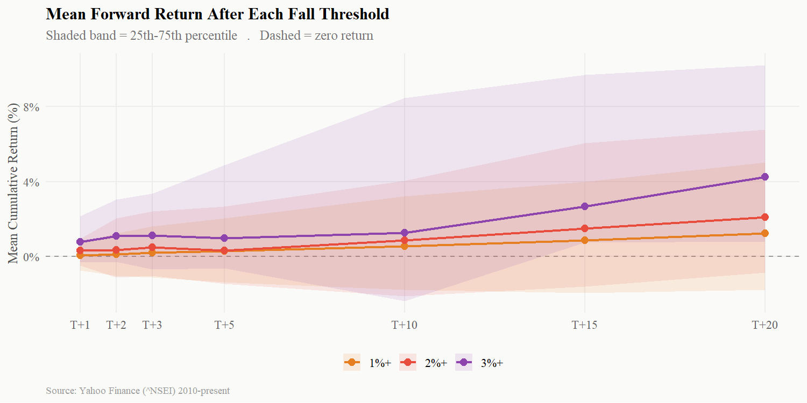
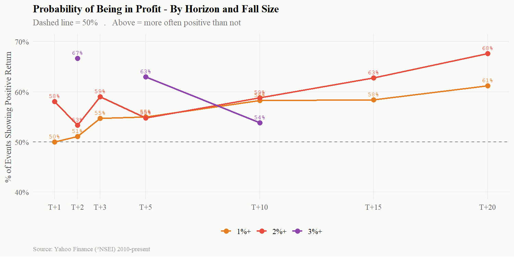
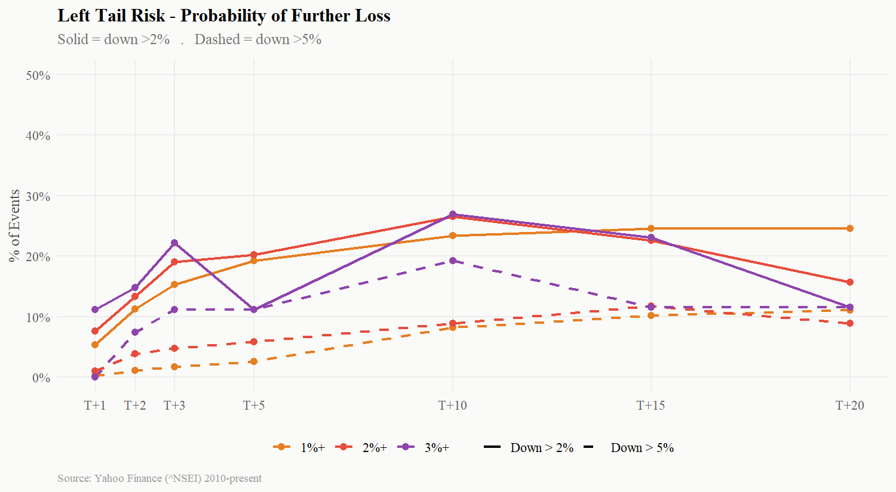
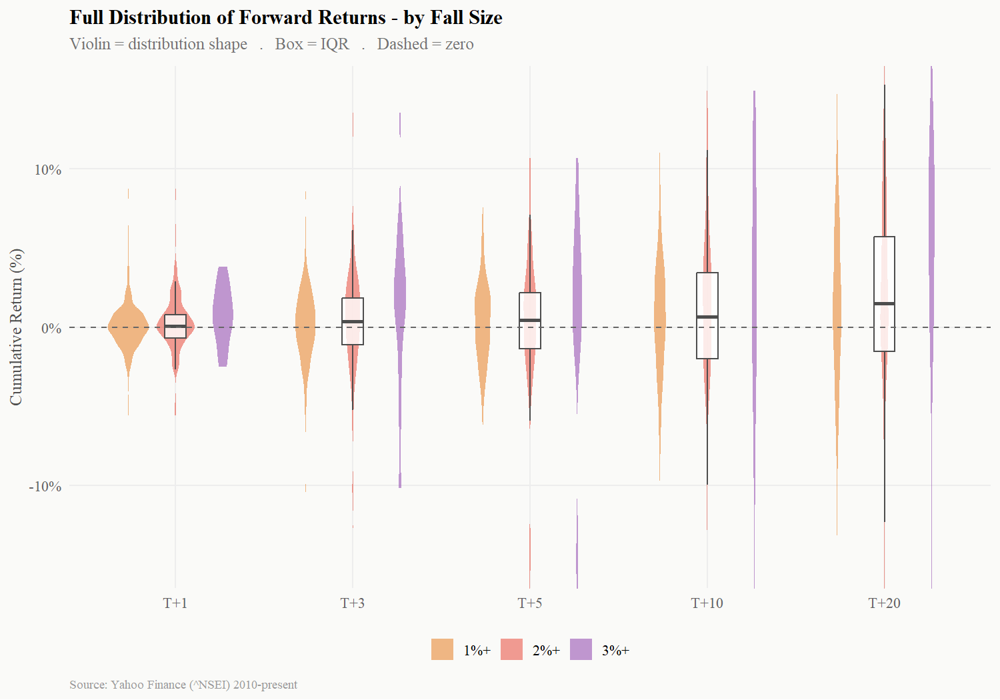
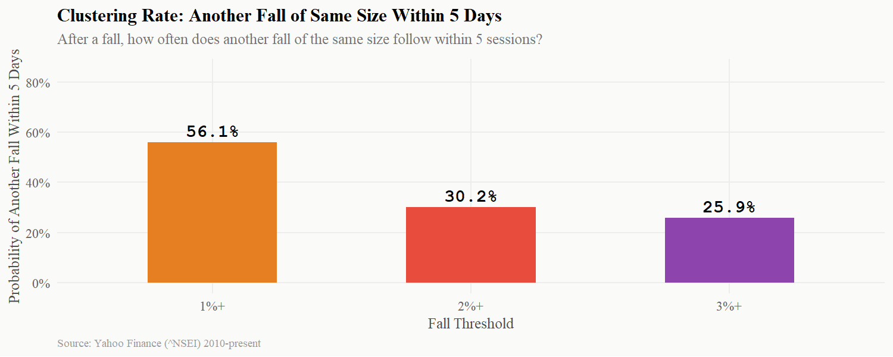
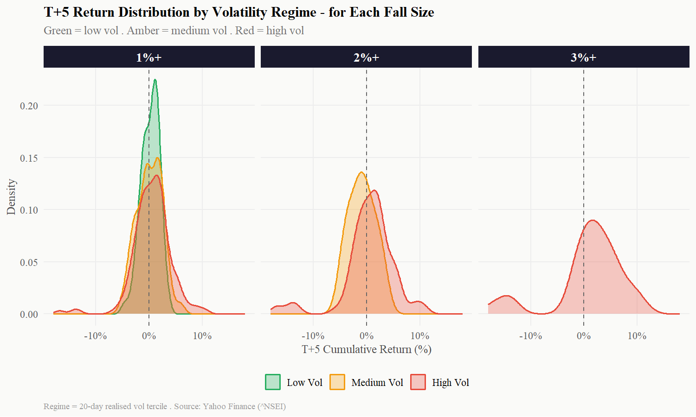
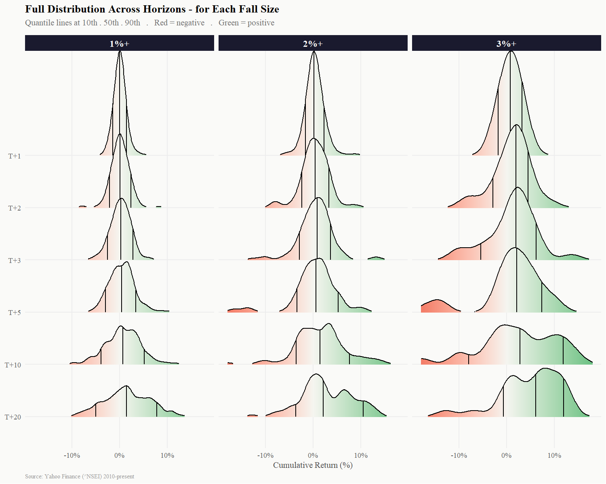
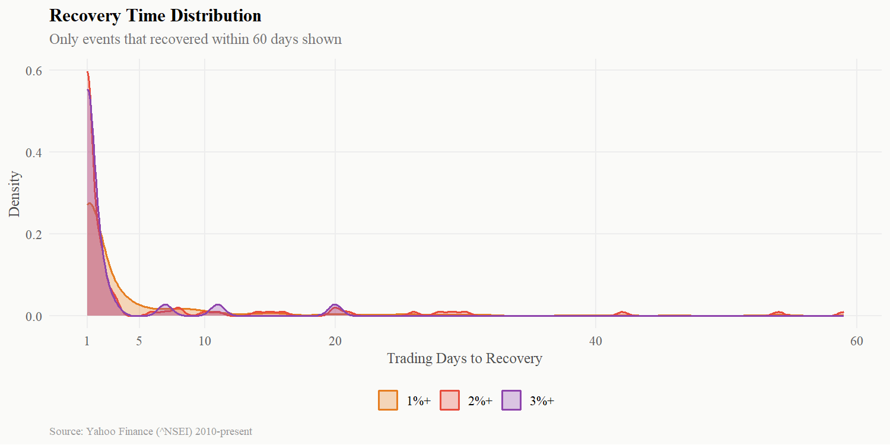

<style type="text/css">
@import url('https://fonts.googleapis.com/css2?family=Playfair+Display:ital,wght@0,700;1,400&family=Source+Serif+4:ital,wght@0,400;0,600;1,400&family=JetBrains+Mono:wght@400;500&display=swap');

/* ── Layout ───────────────────────────── */
.main-container {
  max-width: 960px;
  margin-left: auto;
  margin-right: auto;
}

/* ── Title block ── */
.title {
  font-family: 'Playfair Display', serif !important;
  font-size: 2.4rem !important;
  font-weight: 700;
  color: #1a1a2e;
  line-height: 1.2;
}

.date {
  font-family: 'JetBrains Mono', monospace;
  font-size: 0.75rem;
  color: #888;
  letter-spacing: 0.08em;
  text-transform: uppercase;
}

/* ── Headings ── */
h1 {
  font-family: 'Playfair Display', serif;
  font-size: 1.65rem;
  font-weight: 700;
  color: #1a1a2e;
  border-bottom: 2px solid #e74c3c;
  padding-bottom: 5px;
  margin-top: 2.2rem;
}

h2 {
  font-family: 'Source Serif 4', serif;
  font-size: 1.15rem;
  font-weight: 600;
  color: #2c3e50;
  margin-top: 1.6rem;
}

/* ── Pull quote ── */
.pullquote {
  font-family: 'Playfair Display', serif;
  font-size: 1.2rem;
  font-style: italic;
  color: #1a3c5e;
  border-top: 2px solid #1a3c5e;
  border-bottom: 2px solid #1a3c5e;
  padding: 0.9rem 0.5rem;
  margin: 1.8rem 1.5rem;
  text-align: center;
  line-height: 1.6;
}

/* ── Callout ── */
.callout {
  background: #fff3cd;
  border-left: 4px solid #f39c12;
  padding: 0.7rem 1.1rem;
  margin: 1rem 0;
  border-radius: 0 6px 6px 0;
  font-size: 0.95rem;
}
.callout.red   { background: #fdecea; border-left-color: #e74c3c; }
.callout.blue  { background: #eaf4fb; border-left-color: #1a3c5e; }
.callout.green { background: #eafaf1; border-left-color: #27ae60; }

/* ── Stat extras not in site CSS ── */
.stat-num.amber { color: #f39c12; }
.stat-box .stat-sub {
  font-size: 0.68rem;
  opacity: 0.45;
  margin-top: 2px;
  display: block;
}

/* ── Tables ── */
table {
  font-family: 'JetBrains Mono', monospace;
  font-size: 1.2rem;
  width: 100%;
  border-collapse: collapse;
  margin: 0.8rem 0 1.4rem 0;
}
thead tr { background: #1a1a2e; color: white; }
thead th { padding: 9px 13px; text-align: center; font-weight: 500; }
tbody tr:nth-child(even) { background: #f7f9fc; }
tbody tr:nth-child(odd)  { background: #ffffff; }
tbody td { padding: 7px 13px; text-align: center; border-bottom: 1px solid #e8eaed; }
tbody td:first-child { text-align: left; font-weight: 600; }

/* ── Code ── */
pre, code {
  font-family: 'JetBrains Mono', monospace;
  font-size: 0.81rem;
  background: #f4f4f8;
  border-radius: 4px;
}

/* ── Misc ── */
.plot-caption {
  font-size: 0.81rem;
  color: #888;
  text-align: center;
  margin-top: -0.4rem;
  margin-bottom: 1.4rem;
  font-style: italic;
}

hr {
  border: none;
  border-top: 1px solid #e0e0e0;
  margin: 1.8rem 0;
}
</style>


``` r
library(quantmod)
library(tidyverse)
library(scales)
library(glue)
library(ggridges)
library(slider)
library(kableExtra)
library(patchwork)

theme_report <- function(base = 13) {
  theme_minimal(base_size = base, base_family = "serif") +
    theme(
      plot.title       = element_text(face = "bold", size = base + 2, family = "serif"),
      plot.subtitle    = element_text(color = "grey45", size = base - 1, margin = margin(b = 10)),
      plot.caption     = element_text(color = "grey60", size = base - 4, hjust = 0),
      axis.title       = element_text(size = base - 1, color = "grey30"),
      axis.text        = element_text(size = base - 2, color = "grey40"),
      panel.grid.minor = element_blank(),
      panel.grid.major = element_line(color = "grey93"),
      legend.position  = "bottom",
      legend.title     = element_blank(),
      strip.text       = element_text(face = "bold", size = base),
      plot.background  = element_rect(fill = "#fafaf8", color = NA),
      panel.background = element_rect(fill = "#fafaf8", color = NA)
    )
}

PAL <- c(
  "1%+" = "#e67e22",
  "2%+" = "#e74c3c",
  "3%+" = "#8e44ad"
)

HORIZONS <- c(1, 2, 3, 5, 10, 15, 20)
```


``` r
getSymbols("^NSEI", from = "2010-01-01", to = "2026-03-28", auto.assign = TRUE)

nifty <- NSEI |>
  as.data.frame() |>
  rownames_to_column("date") |>
  as_tibble() |>
  transmute(
    date  = as.Date(date),
    open  = NSEI.Open,
    high  = NSEI.High,
    low   = NSEI.Low,
    close = NSEI.Close
  ) |>
  drop_na(close) |>
  arrange(date) |>
  mutate(
    ret          = close / lag(close) - 1,
    log_ret      = log(close / lag(close)),
    realised_vol = slide_dbl(log_ret, sd, .before = 19, .complete = TRUE) * sqrt(252) * 100,
    vol_regime   = case_when(
      realised_vol <= quantile(realised_vol, 0.33, na.rm = TRUE) ~ "Low Vol",
      realised_vol <= quantile(realised_vol, 0.66, na.rm = TRUE) ~ "Medium Vol",
      TRUE ~ "High Vol"
    ) |> fct_relevel("Low Vol", "Medium Vol", "High Vol")
  ) |>
  drop_na(ret)
```


``` r
thresholds <- list("1%+" = -0.01, "2%+" = -0.02, "3%+" = -0.03)

fwd_all <- map_dfr(names(thresholds), function(label) {
  thresh   <- thresholds[[label]]
  fall_idx <- which(nifty$ret <= thresh)

  map_dfr(fall_idx, function(i) {
    map_dfr(HORIZONS, function(h) {
      if (i + h <= nrow(nifty)) {
        tibble(
          fall_date  = nifty$date[i],
          fall_ret   = nifty$ret[i] * 100,
          vol_regime = nifty$vol_regime[i],
          threshold  = label,
          horizon    = h,
          fwd_ret    = (nifty$close[i + h] / nifty$close[i] - 1) * 100
        )
      }
    })
  })
}) |>
  mutate(
    threshold     = fct_relevel(threshold, "1%+", "2%+", "3%+"),
    horizon_label = factor(paste0("T+", horizon), levels = paste0("T+", HORIZONS))
  )

fwd_summary <- fwd_all |>
  group_by(threshold, horizon, horizon_label) |>
  summarise(
    n          = n(),
    mean_ret   = mean(fwd_ret),
    median_ret = median(fwd_ret),
    sd_ret     = sd(fwd_ret),
    pct_pos    = mean(fwd_ret > 0) * 100,
    pct_dn_2   = mean(fwd_ret < -2) * 100,
    pct_dn_5   = mean(fwd_ret < -5) * 100,
    pct_up_2   = mean(fwd_ret > 2)  * 100,
    pct_up_5   = mean(fwd_ret > 5)  * 100,
    q10        = quantile(fwd_ret, 0.10),
    q25        = quantile(fwd_ret, 0.25),
    q75        = quantile(fwd_ret, 0.75),
    q90        = quantile(fwd_ret, 0.90),
    .groups    = "drop"
  )

cluster_tbl <- map_dfr(names(thresholds), function(label) {
  thresh   <- thresholds[[label]]
  fall_idx <- which(nifty$ret <= thresh)
  hits <- map_lgl(fall_idx, function(i) {
    end_i     <- min(i + 5, nrow(nifty))
    if (i + 1 > end_i) return(FALSE)
    next_rets <- nifty$ret[(i + 1):end_i]
    any(!is.na(next_rets) & next_rets <= thresh)
  })
  tibble(threshold = label, n_falls = length(fall_idx), cluster_rate = mean(hits))
})
```

---

<div class="lead">
When Nifty falls 1%, 2%, or 3% in a single day — does it bounce, continue falling, or just drift sideways? This is a pure price-behaviour study. No strategy attached. Just what the data shows.
</div>

<div class="stat-row"><div class="stat-box"><span class="stat-num amber">471</span><span class="stat-label">Days with 1%+ fall</span><span class="stat-sub">11.8% of all sessions</span></div><div class="stat-box"><span class="stat-num red">106</span><span class="stat-label">Days with 2%+ fall</span><span class="stat-sub">2.7% of all sessions</span></div><div class="stat-box"><span class="stat-num" style="color:#c39bd3">27</span><span class="stat-label">Days with 3%+ fall</span><span class="stat-sub">0.7% of all sessions</span></div><div class="stat-box"><span class="stat-num blue">3986</span><span class="stat-label">Total trading days</span><span class="stat-sub">2010 – present</span></div></div>

---

# Do Markets Bounce After a Fall?

The short answer is: sometimes, but not reliably, and the bigger the fall the weaker the immediate recovery.


``` r
tbl_fwd <- fwd_summary |>
  filter(horizon %in% c(1, 2, 3, 5, 10, 20)) |>
  arrange(threshold, horizon) |>
  mutate(
    `Fall Size`   = as.character(threshold),
    `Horizon`     = as.character(horizon_label),
    `Mean Return` = paste0(ifelse(mean_ret >= 0, "+", ""), round(mean_ret, 2), "%"),
    `Median`      = paste0(ifelse(median_ret >= 0, "+", ""), round(median_ret, 2), "%"),
    `% Positive`  = paste0(round(pct_pos, 1), "%"),
    `% Up >2%`    = paste0(round(pct_up_2, 1), "%"),
    `% Down >2%`  = paste0(round(pct_dn_2, 1), "%"),
    `% Down >5%`  = paste0(round(pct_dn_5, 1), "%")
  )

pos_colors <- ifelse(tbl_fwd$pct_pos > 54, "#27ae60", "#e74c3c")

tbl_fwd |>
  select(`Fall Size`, `Horizon`, `Mean Return`, `Median`,
         `% Positive`, `% Up >2%`, `% Down >2%`, `% Down >5%`) |>
  kbl(align = c("l", "l", "c", "c", "c", "c", "c", "c")) |>
  kable_styling(full_width = TRUE, bootstrap_options = c("hover")) |>
  column_spec(5, color = pos_colors) |>
  column_spec(7, color = "#e74c3c") |>
  column_spec(8, color = "#8e44ad")
```

<table class="table table-hover" style="color: black; margin-left: auto; margin-right: auto;">
 <thead>
  <tr>
   <th style="text-align:left;"> Fall Size </th>
   <th style="text-align:left;"> Horizon </th>
   <th style="text-align:center;"> Mean Return </th>
   <th style="text-align:center;"> Median </th>
   <th style="text-align:center;"> % Positive </th>
   <th style="text-align:center;"> % Up &gt;2% </th>
   <th style="text-align:center;"> % Down &gt;2% </th>
   <th style="text-align:center;"> % Down &gt;5% </th>
  </tr>
 </thead>
<tbody>
  <tr>
   <td style="text-align:left;"> 1%+ </td>
   <td style="text-align:left;"> T+1 </td>
   <td style="text-align:center;"> +0.04% </td>
   <td style="text-align:center;"> +0% </td>
   <td style="text-align:center;color: rgba(231, 76, 60, 255) !important;"> 50% </td>
   <td style="text-align:center;"> 6% </td>
   <td style="text-align:center;color: rgba(231, 76, 60, 255) !important;"> 5.3% </td>
   <td style="text-align:center;color: rgba(142, 68, 173, 255) !important;"> 0.2% </td>
  </tr>
  <tr>
   <td style="text-align:left;"> 1%+ </td>
   <td style="text-align:left;"> T+2 </td>
   <td style="text-align:center;"> +0.11% </td>
   <td style="text-align:center;"> +0.08% </td>
   <td style="text-align:center;color: rgba(231, 76, 60, 255) !important;"> 51.1% </td>
   <td style="text-align:center;"> 14.5% </td>
   <td style="text-align:center;color: rgba(231, 76, 60, 255) !important;"> 11.3% </td>
   <td style="text-align:center;color: rgba(142, 68, 173, 255) !important;"> 1.1% </td>
  </tr>
  <tr>
   <td style="text-align:left;"> 1%+ </td>
   <td style="text-align:left;"> T+3 </td>
   <td style="text-align:center;"> +0.2% </td>
   <td style="text-align:center;"> +0.26% </td>
   <td style="text-align:center;color: rgba(39, 174, 96, 255) !important;"> 54.7% </td>
   <td style="text-align:center;"> 18.9% </td>
   <td style="text-align:center;color: rgba(231, 76, 60, 255) !important;"> 15.3% </td>
   <td style="text-align:center;color: rgba(142, 68, 173, 255) !important;"> 1.7% </td>
  </tr>
  <tr>
   <td style="text-align:left;"> 1%+ </td>
   <td style="text-align:left;"> T+5 </td>
   <td style="text-align:center;"> +0.29% </td>
   <td style="text-align:center;"> +0.43% </td>
   <td style="text-align:center;color: rgba(39, 174, 96, 255) !important;"> 55% </td>
   <td style="text-align:center;"> 25.2% </td>
   <td style="text-align:center;color: rgba(231, 76, 60, 255) !important;"> 19.2% </td>
   <td style="text-align:center;color: rgba(142, 68, 173, 255) !important;"> 2.6% </td>
  </tr>
  <tr>
   <td style="text-align:left;"> 1%+ </td>
   <td style="text-align:left;"> T+10 </td>
   <td style="text-align:center;"> +0.55% </td>
   <td style="text-align:center;"> +0.66% </td>
   <td style="text-align:center;color: rgba(39, 174, 96, 255) !important;"> 58.2% </td>
   <td style="text-align:center;"> 36.8% </td>
   <td style="text-align:center;color: rgba(231, 76, 60, 255) !important;"> 23.3% </td>
   <td style="text-align:center;color: rgba(142, 68, 173, 255) !important;"> 8.1% </td>
  </tr>
  <tr>
   <td style="text-align:left;"> 1%+ </td>
   <td style="text-align:left;"> T+20 </td>
   <td style="text-align:center;"> +1.24% </td>
   <td style="text-align:center;"> +1.37% </td>
   <td style="text-align:center;color: rgba(39, 174, 96, 255) !important;"> 61.2% </td>
   <td style="text-align:center;"> 44% </td>
   <td style="text-align:center;color: rgba(231, 76, 60, 255) !important;"> 24.5% </td>
   <td style="text-align:center;color: rgba(142, 68, 173, 255) !important;"> 11.1% </td>
  </tr>
  <tr>
   <td style="text-align:left;"> 2%+ </td>
   <td style="text-align:left;"> T+1 </td>
   <td style="text-align:center;"> +0.32% </td>
   <td style="text-align:center;"> +0.15% </td>
   <td style="text-align:center;color: rgba(39, 174, 96, 255) !important;"> 58.1% </td>
   <td style="text-align:center;"> 14.3% </td>
   <td style="text-align:center;color: rgba(231, 76, 60, 255) !important;"> 7.6% </td>
   <td style="text-align:center;color: rgba(142, 68, 173, 255) !important;"> 1% </td>
  </tr>
  <tr>
   <td style="text-align:left;"> 2%+ </td>
   <td style="text-align:left;"> T+2 </td>
   <td style="text-align:center;"> +0.35% </td>
   <td style="text-align:center;"> +0.39% </td>
   <td style="text-align:center;color: rgba(231, 76, 60, 255) !important;"> 53.3% </td>
   <td style="text-align:center;"> 25.7% </td>
   <td style="text-align:center;color: rgba(231, 76, 60, 255) !important;"> 13.3% </td>
   <td style="text-align:center;color: rgba(142, 68, 173, 255) !important;"> 3.8% </td>
  </tr>
  <tr>
   <td style="text-align:left;"> 2%+ </td>
   <td style="text-align:left;"> T+3 </td>
   <td style="text-align:center;"> +0.5% </td>
   <td style="text-align:center;"> +0.82% </td>
   <td style="text-align:center;color: rgba(39, 174, 96, 255) !important;"> 59% </td>
   <td style="text-align:center;"> 29.5% </td>
   <td style="text-align:center;color: rgba(231, 76, 60, 255) !important;"> 19% </td>
   <td style="text-align:center;color: rgba(142, 68, 173, 255) !important;"> 4.8% </td>
  </tr>
  <tr>
   <td style="text-align:left;"> 2%+ </td>
   <td style="text-align:left;"> T+5 </td>
   <td style="text-align:center;"> +0.3% </td>
   <td style="text-align:center;"> +0.57% </td>
   <td style="text-align:center;color: rgba(39, 174, 96, 255) !important;"> 54.8% </td>
   <td style="text-align:center;"> 32.7% </td>
   <td style="text-align:center;color: rgba(231, 76, 60, 255) !important;"> 20.2% </td>
   <td style="text-align:center;color: rgba(142, 68, 173, 255) !important;"> 5.8% </td>
  </tr>
  <tr>
   <td style="text-align:left;"> 2%+ </td>
   <td style="text-align:left;"> T+10 </td>
   <td style="text-align:center;"> +0.87% </td>
   <td style="text-align:center;"> +1.24% </td>
   <td style="text-align:center;color: rgba(39, 174, 96, 255) !important;"> 58.8% </td>
   <td style="text-align:center;"> 46.1% </td>
   <td style="text-align:center;color: rgba(231, 76, 60, 255) !important;"> 26.5% </td>
   <td style="text-align:center;color: rgba(142, 68, 173, 255) !important;"> 8.8% </td>
  </tr>
  <tr>
   <td style="text-align:left;"> 2%+ </td>
   <td style="text-align:left;"> T+20 </td>
   <td style="text-align:center;"> +2.09% </td>
   <td style="text-align:center;"> +2.02% </td>
   <td style="text-align:center;color: rgba(39, 174, 96, 255) !important;"> 67.6% </td>
   <td style="text-align:center;"> 51% </td>
   <td style="text-align:center;color: rgba(231, 76, 60, 255) !important;"> 15.7% </td>
   <td style="text-align:center;color: rgba(142, 68, 173, 255) !important;"> 8.8% </td>
  </tr>
  <tr>
   <td style="text-align:left;"> 3%+ </td>
   <td style="text-align:left;"> T+1 </td>
   <td style="text-align:center;"> +0.77% </td>
   <td style="text-align:center;"> +0.78% </td>
   <td style="text-align:center;color: rgba(39, 174, 96, 255) !important;"> 70.4% </td>
   <td style="text-align:center;"> 25.9% </td>
   <td style="text-align:center;color: rgba(231, 76, 60, 255) !important;"> 11.1% </td>
   <td style="text-align:center;color: rgba(142, 68, 173, 255) !important;"> 0% </td>
  </tr>
  <tr>
   <td style="text-align:left;"> 3%+ </td>
   <td style="text-align:left;"> T+2 </td>
   <td style="text-align:center;"> +1.09% </td>
   <td style="text-align:center;"> +1.89% </td>
   <td style="text-align:center;color: rgba(39, 174, 96, 255) !important;"> 66.7% </td>
   <td style="text-align:center;"> 48.1% </td>
   <td style="text-align:center;color: rgba(231, 76, 60, 255) !important;"> 14.8% </td>
   <td style="text-align:center;color: rgba(142, 68, 173, 255) !important;"> 7.4% </td>
  </tr>
  <tr>
   <td style="text-align:left;"> 3%+ </td>
   <td style="text-align:left;"> T+3 </td>
   <td style="text-align:center;"> +1.12% </td>
   <td style="text-align:center;"> +1.93% </td>
   <td style="text-align:center;color: rgba(39, 174, 96, 255) !important;"> 70.4% </td>
   <td style="text-align:center;"> 48.1% </td>
   <td style="text-align:center;color: rgba(231, 76, 60, 255) !important;"> 22.2% </td>
   <td style="text-align:center;color: rgba(142, 68, 173, 255) !important;"> 11.1% </td>
  </tr>
  <tr>
   <td style="text-align:left;"> 3%+ </td>
   <td style="text-align:left;"> T+5 </td>
   <td style="text-align:center;"> +0.97% </td>
   <td style="text-align:center;"> +2.08% </td>
   <td style="text-align:center;color: rgba(39, 174, 96, 255) !important;"> 63% </td>
   <td style="text-align:center;"> 51.9% </td>
   <td style="text-align:center;color: rgba(231, 76, 60, 255) !important;"> 11.1% </td>
   <td style="text-align:center;color: rgba(142, 68, 173, 255) !important;"> 11.1% </td>
  </tr>
  <tr>
   <td style="text-align:left;"> 3%+ </td>
   <td style="text-align:left;"> T+10 </td>
   <td style="text-align:center;"> +1.25% </td>
   <td style="text-align:center;"> +2.55% </td>
   <td style="text-align:center;color: rgba(231, 76, 60, 255) !important;"> 53.8% </td>
   <td style="text-align:center;"> 53.8% </td>
   <td style="text-align:center;color: rgba(231, 76, 60, 255) !important;"> 26.9% </td>
   <td style="text-align:center;color: rgba(142, 68, 173, 255) !important;"> 19.2% </td>
  </tr>
  <tr>
   <td style="text-align:left;"> 3%+ </td>
   <td style="text-align:left;"> T+20 </td>
   <td style="text-align:center;"> +4.24% </td>
   <td style="text-align:center;"> +6.05% </td>
   <td style="text-align:center;color: rgba(39, 174, 96, 255) !important;"> 84.6% </td>
   <td style="text-align:center;"> 69.2% </td>
   <td style="text-align:center;color: rgba(231, 76, 60, 255) !important;"> 11.5% </td>
   <td style="text-align:center;color: rgba(142, 68, 173, 255) !important;"> 11.5% </td>
  </tr>
</tbody>
</table>

## Mean Return Path

The mean line is the most misleading summary. It looks positive at most horizons. But means are pulled up by sharp bounce days and do not reflect what most fall events actually deliver.


``` r
fwd_summary |>
  ggplot(aes(x = horizon, y = mean_ret, color = threshold, group = threshold)) +
  geom_hline(yintercept = 0, linetype = "dashed", color = "grey60", linewidth = 0.6) +
  geom_ribbon(
    aes(ymin = q25, ymax = q75, fill = threshold),
    alpha = 0.12, color = NA
  ) +
  geom_line(linewidth = 1.1) +
  geom_point(size = 2.8) +
  scale_color_manual(values = PAL) +
  scale_fill_manual(values  = PAL) +
  scale_x_continuous(breaks = HORIZONS, labels = paste0("T+", HORIZONS)) +
  scale_y_continuous(labels = label_percent(scale = 1, suffix = "%")) +
  labs(
    title    = "Mean Forward Return After Each Fall Threshold",
    subtitle = "Shaded band = 25th-75th percentile   .   Dashed = zero return",
    x        = NULL,
    y        = "Mean Cumulative Return (%)",
    caption  = "Source: Yahoo Finance (^NSEI) 2010-present"
  ) +
  theme_report()
```



<div class="plot-caption">Mean returns look encouraging. The IQR band tells you how wide the uncertainty is around that mean.</div>

A 1% fall does tend to recover slowly on average. A 3% fall has a weaker mean path — the recovery, when it comes, takes longer and is less consistent.

---

# The Bounce Is Not Reliable

The mean being positive does not mean you get a bounce. More than 40% of the time, the market is still lower at T+1 after a 1% fall. After a 3% fall, it is closer to half.


``` r
fwd_summary |>
  ggplot(aes(x = horizon, y = pct_pos, color = threshold, group = threshold)) +
  geom_hline(yintercept = 50, linetype = "dashed", color = "grey50", linewidth = 0.6) +
  geom_line(linewidth = 1.1) +
  geom_point(size = 3) +
  geom_text(
    aes(label = paste0(round(pct_pos, 0), "%")),
    vjust = -1, size = 3, show.legend = FALSE,
    family = "mono"
  ) +
  scale_color_manual(values = PAL) +
  scale_x_continuous(breaks = HORIZONS, labels = paste0("T+", HORIZONS)) +
  scale_y_continuous(labels = label_percent(scale = 1), limits = c(40, 70)) +
  labs(
    title    = "Probability of Being in Profit - By Horizon and Fall Size",
    subtitle = "Dashed line = 50%   .   Above = more often positive than not",
    x        = NULL,
    y        = "% of Events Showing Positive Return",
    caption  = "Source: Yahoo Finance (^NSEI) 2010-present"
  ) +
  theme_report()
```



<div class="plot-caption">After a 3%+ fall, you are essentially coin-flipping on T+1. The probability only crosses 55% around T+10 to T+20.</div>

<div class="callout">
The longer you wait after the fall, the more likely you are in profit — but the gap between 1% and 3% fall events narrows over time. By T+20, all three thresholds converge around 55-60% positive.
</div>

---

# The Left Tail Is What Actually Matters

The mean and % positive tell you about the average case. The left tail tells you about the painful case — and painful cases are far more common than people expect.


``` r
fwd_summary |>
  select(threshold, horizon_label, horizon, pct_dn_2, pct_dn_5) |>
  pivot_longer(
    cols      = c(pct_dn_2, pct_dn_5),
    names_to  = "tail",
    values_to = "pct"
  ) |>
  mutate(tail = recode(tail, pct_dn_2 = "Down > 2%", pct_dn_5 = "Down > 5%")) |>
  ggplot(aes(x = horizon, y = pct, color = threshold, linetype = tail, group = interaction(threshold, tail))) +
  geom_line(linewidth = 0.9) +
  geom_point(size = 2.4) +
  scale_color_manual(values = PAL) +
  scale_linetype_manual(values = c("Down > 2%" = "solid", "Down > 5%" = "dashed")) +
  scale_x_continuous(breaks = HORIZONS, labels = paste0("T+", HORIZONS)) +
  scale_y_continuous(labels = label_percent(scale = 1), limits = c(0, 50)) +
  labs(
    title    = "Left Tail Risk - Probability of Further Loss",
    subtitle = "Solid = down >2%   .   Dashed = down >5%",
    x        = NULL,
    y        = "% of Events",
    caption  = "Source: Yahoo Finance (^NSEI) 2010-present"
  ) +
  theme_report()
```



<div class="plot-caption">By T+10, roughly 1 in 4 events after a 1% fall are still down more than 2%. After a 3%+ fall, nearly 1 in 3 are.</div>

The left tail grows steadily with horizon. This is not a fixed risk you take on day one and then get resolved — it compounds over time.

---

# Full Distribution: How Spread Out Are Outcomes?


``` r
fwd_all |>
  filter(horizon %in% c(1, 3, 5, 10, 20)) |>
  ggplot(aes(x = horizon_label, y = fwd_ret, fill = threshold)) +
  geom_violin(
    alpha    = 0.55,
    color    = NA,
    trim     = TRUE,
    position = position_dodge(width = 0.8),
    width    = 0.7
  ) +
  geom_boxplot(
    width         = 0.12,
    outlier.shape = NA,
    color         = "grey30",
    fill          = "white",
    alpha         = 0.8,
    position      = position_dodge(width = 0.8)
  ) +
  geom_hline(yintercept = 0, linetype = "dashed", color = "grey40", linewidth = 0.6) +
  coord_cartesian(ylim = c(-15, 15)) +
  scale_fill_manual(values = PAL) +
  scale_y_continuous(labels = label_percent(scale = 1, suffix = "%")) +
  labs(
    title    = "Full Distribution of Forward Returns - by Fall Size",
    subtitle = "Violin = distribution shape   .   Box = IQR   .   Dashed = zero",
    x        = NULL,
    y        = "Cumulative Return (%)",
    caption  = "Source: Yahoo Finance (^NSEI) 2010-present"
  ) +
  theme_report()
```



<div class="plot-caption">The 3%+ fall (purple) has a wider, flatter distribution — more extreme outcomes in both directions.</div>

---

# Volatility Clustering: Does the Fall Attract More Falls?


``` r
cluster_tbl |>
  mutate(threshold = fct_relevel(threshold, "1%+", "2%+", "3%+")) |>
  ggplot(aes(x = threshold, y = cluster_rate, fill = threshold)) +
  geom_col(width = 0.5, show.legend = FALSE) +
  geom_text(
    aes(label = percent(cluster_rate, 0.1)),
    vjust    = -0.5,
    size     = 5,
    fontface = "bold",
    family   = "mono"
  ) +
  scale_fill_manual(values = PAL) +
  scale_y_continuous(labels = label_percent(), limits = c(0, 0.85)) +
  labs(
    title    = "Clustering Rate: Another Fall of Same Size Within 5 Days",
    subtitle = "After a fall, how often does another fall of the same size follow within 5 sessions?",
    x        = "Fall Threshold",
    y        = "Probability of Another Fall Within 5 Days",
    caption  = "Source: Yahoo Finance (^NSEI) 2010-present"
  ) +
  theme_report()
```



<div class="plot-caption">The clustering rate drops as the threshold rises — but 3%+ falls still cluster more than 1 in 3 times.</div>


``` r
c1 <- cluster_tbl$cluster_rate[cluster_tbl$threshold == "1%+"]
c2 <- cluster_tbl$cluster_rate[cluster_tbl$threshold == "2%+"]
c3 <- cluster_tbl$cluster_rate[cluster_tbl$threshold == "3%+"]
```

After a **1%+ fall**, the probability of another 1%+ fall within 5 days is **56.1%**. Falls are not independent coin flips. They happen in clusters.

After a **2%+ fall**, another 2%+ fall within 5 days: **30.2%**.

After a **3%+ fall**, another 3%+ fall within 5 days: **25.9%**. Panic days tend to come in groups, not isolation.

<div class="pullquote">
Falls do not arrive cleanly spaced. One fall day makes the next one more likely, not less.
</div>

---

# Does the Regime Matter? Low vs High Volatility


``` r
regime_fwd <- fwd_all |>
  filter(horizon == 5) |>
  group_by(threshold, vol_regime) |>
  summarise(
    n        = n(),
    mean_ret = mean(fwd_ret),
    pct_pos  = mean(fwd_ret > 0) * 100,
    pct_dn_2 = mean(fwd_ret < -2) * 100,
    pct_dn_5 = mean(fwd_ret < -5) * 100,
    .groups  = "drop"
  )

tbl_regime <- regime_fwd |>
  arrange(threshold, vol_regime) |>
  mutate(
    `Fall Size`  = as.character(threshold),
    `Vol Regime` = as.character(vol_regime),
    `N Events`   = n,
    `Mean T+5`   = paste0(ifelse(mean_ret >= 0, "+", ""), round(mean_ret, 2), "%"),
    `% Positive` = paste0(round(pct_pos, 1), "%"),
    `% Down >2%` = paste0(round(pct_dn_2, 1), "%"),
    `% Down >5%` = paste0(round(pct_dn_5, 1), "%")
  )

regime_colors <- case_when(
  tbl_regime$vol_regime == "Low Vol"  ~ "#27ae60",
  tbl_regime$vol_regime == "High Vol" ~ "#e74c3c",
  TRUE                                 ~ "#f39c12"
)

tbl_regime |>
  select(`Fall Size`, `Vol Regime`, `N Events`,
         `Mean T+5`, `% Positive`, `% Down >2%`, `% Down >5%`) |>
  kbl(align = c("l", "l", "c", "c", "c", "c", "c")) |>
  kable_styling(full_width = TRUE, bootstrap_options = c("hover")) |>
  column_spec(2, color = regime_colors, bold = TRUE)
```

<table class="table table-hover" style="color: black; margin-left: auto; margin-right: auto;">
 <thead>
  <tr>
   <th style="text-align:left;"> Fall Size </th>
   <th style="text-align:left;"> Vol Regime </th>
   <th style="text-align:center;"> N Events </th>
   <th style="text-align:center;"> Mean T+5 </th>
   <th style="text-align:center;"> % Positive </th>
   <th style="text-align:center;"> % Down &gt;2% </th>
   <th style="text-align:center;"> % Down &gt;5% </th>
  </tr>
 </thead>
<tbody>
  <tr>
   <td style="text-align:left;"> 1%+ </td>
   <td style="text-align:left;font-weight: bold;color: rgba(39, 174, 96, 255) !important;"> Low Vol </td>
   <td style="text-align:center;"> 58 </td>
   <td style="text-align:center;"> +0.17% </td>
   <td style="text-align:center;"> 56.9% </td>
   <td style="text-align:center;"> 10.3% </td>
   <td style="text-align:center;"> 0% </td>
  </tr>
  <tr>
   <td style="text-align:left;"> 1%+ </td>
   <td style="text-align:left;font-weight: bold;color: rgba(243, 156, 18, 255) !important;"> Medium Vol </td>
   <td style="text-align:center;"> 145 </td>
   <td style="text-align:center;"> +0.05% </td>
   <td style="text-align:center;"> 51.7% </td>
   <td style="text-align:center;"> 23.4% </td>
   <td style="text-align:center;"> 1.4% </td>
  </tr>
  <tr>
   <td style="text-align:left;"> 1%+ </td>
   <td style="text-align:left;font-weight: bold;color: rgba(231, 76, 60, 255) !important;"> High Vol </td>
   <td style="text-align:center;"> 266 </td>
   <td style="text-align:center;"> +0.45% </td>
   <td style="text-align:center;"> 56.4% </td>
   <td style="text-align:center;"> 18.8% </td>
   <td style="text-align:center;"> 3.8% </td>
  </tr>
  <tr>
   <td style="text-align:left;"> 2%+ </td>
   <td style="text-align:left;font-weight: bold;color: rgba(243, 156, 18, 255) !important;"> Medium Vol </td>
   <td style="text-align:center;"> 14 </td>
   <td style="text-align:center;"> -0.86% </td>
   <td style="text-align:center;"> 35.7% </td>
   <td style="text-align:center;"> 35.7% </td>
   <td style="text-align:center;"> 0% </td>
  </tr>
  <tr>
   <td style="text-align:left;"> 2%+ </td>
   <td style="text-align:left;font-weight: bold;color: rgba(231, 76, 60, 255) !important;"> High Vol </td>
   <td style="text-align:center;"> 90 </td>
   <td style="text-align:center;"> +0.48% </td>
   <td style="text-align:center;"> 57.8% </td>
   <td style="text-align:center;"> 17.8% </td>
   <td style="text-align:center;"> 6.7% </td>
  </tr>
  <tr>
   <td style="text-align:left;"> 3%+ </td>
   <td style="text-align:left;font-weight: bold;color: rgba(231, 76, 60, 255) !important;"> High Vol </td>
   <td style="text-align:center;"> 27 </td>
   <td style="text-align:center;"> +0.97% </td>
   <td style="text-align:center;"> 63% </td>
   <td style="text-align:center;"> 11.1% </td>
   <td style="text-align:center;"> 11.1% </td>
  </tr>
</tbody>
</table>


``` r
fwd_all |>
  filter(horizon == 5) |>
  ggplot(aes(x = fwd_ret, fill = vol_regime, color = vol_regime)) +
  geom_density(alpha = 0.3, linewidth = 0.8) +
  geom_vline(xintercept = 0, linetype = "dashed", color = "grey40") +
  facet_wrap(~ threshold, ncol = 3) +
  scale_fill_manual(values = c(
    "Low Vol"    = "#27ae60",
    "Medium Vol" = "#f39c12",
    "High Vol"   = "#e74c3c"
  )) +
  scale_color_manual(values = c(
    "Low Vol"    = "#27ae60",
    "Medium Vol" = "#f39c12",
    "High Vol"   = "#e74c3c"
  )) +
  scale_x_continuous(labels = label_percent(scale = 1), limits = c(-18, 18)) +
  labs(
    title    = "T+5 Return Distribution by Volatility Regime - for Each Fall Size",
    subtitle = "Green = low vol . Amber = medium vol . Red = high vol",
    x        = "T+5 Cumulative Return (%)",
    y        = "Density",
    caption  = "Regime = 20-day realised vol tercile . Source: Yahoo Finance (^NSEI)"
  ) +
  theme_report() +
  theme(
    strip.background = element_rect(fill = "#1a1a2e", color = NA),
    strip.text       = element_text(color = "white")
  )
```



<div class="plot-caption">A 1% fall in a high-vol regime behaves more like a 3% fall in a low-vol regime.</div>

The key finding: **a 1% fall in a high-vol regime behaves more like a 3% fall in a low-vol regime**. The threshold alone does not tell you what happens next.

---

# Ridge View: All Horizons Together


``` r
fwd_all |>
  filter(horizon %in% c(1, 2, 3, 5, 10, 20)) |>
  ggplot(aes(x = fwd_ret, y = fct_rev(horizon_label), fill = after_stat(x))) +
  geom_density_ridges_gradient(
    scale          = 2.0,
    rel_min_height = 0.01,
    quantile_lines = TRUE,
    quantiles      = c(0.10, 0.50, 0.90),
    gradient_lwd   = 0.3
  ) +
  scale_fill_gradient2(
    low      = "#e74c3c",
    mid      = "#f5f5f0",
    high     = "#27ae60",
    midpoint = 0,
    guide    = "none"
  ) +
  scale_x_continuous(labels = label_percent(scale = 1), limits = c(-18, 18)) +
  facet_wrap(~ threshold, ncol = 3) +
  labs(
    title    = "Full Distribution Across Horizons - for Each Fall Size",
    subtitle = "Quantile lines at 10th . 50th . 90th   .   Red = negative   .   Green = positive",
    x        = "Cumulative Return (%)",
    y        = NULL,
    caption  = "Source: Yahoo Finance (^NSEI) 2010-present"
  ) +
  theme_report(base = 11) +
  theme(
    strip.background = element_rect(fill = "#1a1a2e", color = NA),
    strip.text       = element_text(color = "white"),
    axis.text.y      = element_text(size = 9)
  )
```



---

# Recovery Speed: How Long Does It Take to Get Back?


``` r
MAX_HORIZON <- 60

recovery_tbl <- map_dfr(names(thresholds), function(label) {
  thresh   <- thresholds[[label]]
  fall_idx <- which(nifty$ret <= thresh)

  tibble(fall_idx = fall_idx) |>
    mutate(
      fall_date  = nifty$date[fall_idx],
      fall_close = nifty$close[fall_idx],
      threshold  = label
    ) |>
    mutate(
      recovered_at = map_int(fall_idx, function(i) {
        end_i  <- min(i + MAX_HORIZON, nrow(nifty))
        if (i >= end_i) return(NA_integer_)
        future <- nifty$close[(i + 1):end_i]
        hit    <- which(!is.na(future) & future >= nifty$close[i])
        if (length(hit) == 0L) NA_integer_ else hit[1L]
      })
    )
}) |>
  mutate(threshold = fct_relevel(threshold, "1%+", "2%+", "3%+"))

recovery_summary <- recovery_tbl |>
  group_by(threshold) |>
  summarise(
    n_events        = n(),
    pct_recover_5d  = mean(recovered_at <= 5,  na.rm = TRUE) * 100,
    pct_recover_10d = mean(recovered_at <= 10, na.rm = TRUE) * 100,
    pct_recover_20d = mean(recovered_at <= 20, na.rm = TRUE) * 100,
    pct_no_recover  = mean(is.na(recovered_at)) * 100,
    median_days     = median(recovered_at, na.rm = TRUE),
    .groups         = "drop"
  )
```


``` r
recovery_summary |>
  transmute(
    `Fall Size`        = threshold,
    `Events`           = n_events,
    `Recovered in 5d`  = paste0(round(pct_recover_5d, 1), "%"),
    `Recovered in 10d` = paste0(round(pct_recover_10d, 1), "%"),
    `Recovered in 20d` = paste0(round(pct_recover_20d, 1), "%"),
    `Not in 60d`       = paste0(round(pct_no_recover, 1), "%"),
    `Median Days`      = round(median_days, 0)
  ) |>
  kbl(align = c("l", "c", "c", "c", "c", "c", "c")) |>
  kable_styling(full_width = TRUE, bootstrap_options = c("hover")) |>
  column_spec(6, color = "#e74c3c", bold = TRUE)
```

<table class="table table-hover" style="color: black; margin-left: auto; margin-right: auto;">
 <thead>
  <tr>
   <th style="text-align:left;"> Fall Size </th>
   <th style="text-align:center;"> Events </th>
   <th style="text-align:center;"> Recovered in 5d </th>
   <th style="text-align:center;"> Recovered in 10d </th>
   <th style="text-align:center;"> Recovered in 20d </th>
   <th style="text-align:center;"> Not in 60d </th>
   <th style="text-align:center;"> Median Days </th>
  </tr>
 </thead>
<tbody>
  <tr>
   <td style="text-align:left;"> 1%+ </td>
   <td style="text-align:center;"> 471 </td>
   <td style="text-align:center;"> 80.7% </td>
   <td style="text-align:center;"> 88.5% </td>
   <td style="text-align:center;"> 93.7% </td>
   <td style="text-align:center;font-weight: bold;color: rgba(231, 76, 60, 255) !important;"> 5.5% </td>
   <td style="text-align:center;"> 1 </td>
  </tr>
  <tr>
   <td style="text-align:left;"> 2%+ </td>
   <td style="text-align:center;"> 106 </td>
   <td style="text-align:center;"> 81.2% </td>
   <td style="text-align:center;"> 86.1% </td>
   <td style="text-align:center;"> 92.1% </td>
   <td style="text-align:center;font-weight: bold;color: rgba(231, 76, 60, 255) !important;"> 4.7% </td>
   <td style="text-align:center;"> 1 </td>
  </tr>
  <tr>
   <td style="text-align:left;"> 3%+ </td>
   <td style="text-align:center;"> 27 </td>
   <td style="text-align:center;"> 88.9% </td>
   <td style="text-align:center;"> 92.6% </td>
   <td style="text-align:center;"> 100% </td>
   <td style="text-align:center;font-weight: bold;color: rgba(231, 76, 60, 255) !important;"> 0% </td>
   <td style="text-align:center;"> 1 </td>
  </tr>
</tbody>
</table>


``` r
recovery_tbl |>
  filter(!is.na(recovered_at), recovered_at <= 60) |>
  ggplot(aes(x = recovered_at, fill = threshold, color = threshold)) +
  geom_density(alpha = 0.3, linewidth = 0.8, adjust = 1.5) +
  scale_fill_manual(values  = PAL) +
  scale_color_manual(values = PAL) +
  scale_x_continuous(breaks = c(1, 5, 10, 20, 40, 60)) +
  labs(
    title    = "Recovery Time Distribution",
    subtitle = "Only events that recovered within 60 days shown",
    x        = "Trading Days to Recovery",
    y        = "Density",
    caption  = "Source: Yahoo Finance (^NSEI) 2010-present"
  ) +
  theme_report()
```



<div class="plot-caption">1%+ falls recover quickly — most within 5 days. 3%+ falls have a much flatter distribution, with meaningful mass out to 30-40 days.</div>

<div class="pullquote">
The bigger the fall, the longer and less certain the road back.
</div>

---

# Summary


``` r
tibble(
  Question = c(
    "Does the market bounce after a fall?",
    "Is T+1 more likely positive or negative?",
    "Does fall size change the outcome?",
    "Are falls independent events?",
    "Does the vol regime matter?",
    "How long to recover from a 1% fall?",
    "How long to recover from a 3% fall?"
  ),
  Answer = c(
    "On average yes, but only barely and with wide variance",
    "Positive, but only 54-56% of the time — close to a coin flip",
    "Yes. Bigger falls = lower bounce probability, wider outcome range, slower recovery",
    "No. Clustering is high — another fall of the same size within 5 days is common",
    "Significantly. High-vol falls have far worse forward return distributions",
    "Median ~4-5 days. Most recover within a week",
    "Median ~10-14 days. A meaningful fraction do not recover in 60 days"
  )
) |>
  kbl(align = c("l", "l")) |>
  kable_styling(full_width = TRUE, bootstrap_options = c("hover")) |>
  column_spec(1, bold = TRUE, width = "35%") |>
  column_spec(2, width = "65%")
```

<table class="table table-hover" style="color: black; margin-left: auto; margin-right: auto;">
 <thead>
  <tr>
   <th style="text-align:left;"> Question </th>
   <th style="text-align:left;"> Answer </th>
  </tr>
 </thead>
<tbody>
  <tr>
   <td style="text-align:left;width: 35%; font-weight: bold;"> Does the market bounce after a fall? </td>
   <td style="text-align:left;width: 65%; "> On average yes, but only barely and with wide variance </td>
  </tr>
  <tr>
   <td style="text-align:left;width: 35%; font-weight: bold;"> Is T+1 more likely positive or negative? </td>
   <td style="text-align:left;width: 65%; "> Positive, but only 54-56% of the time — close to a coin flip </td>
  </tr>
  <tr>
   <td style="text-align:left;width: 35%; font-weight: bold;"> Does fall size change the outcome? </td>
   <td style="text-align:left;width: 65%; "> Yes. Bigger falls = lower bounce probability, wider outcome range, slower recovery </td>
  </tr>
  <tr>
   <td style="text-align:left;width: 35%; font-weight: bold;"> Are falls independent events? </td>
   <td style="text-align:left;width: 65%; "> No. Clustering is high — another fall of the same size within 5 days is common </td>
  </tr>
  <tr>
   <td style="text-align:left;width: 35%; font-weight: bold;"> Does the vol regime matter? </td>
   <td style="text-align:left;width: 65%; "> Significantly. High-vol falls have far worse forward return distributions </td>
  </tr>
  <tr>
   <td style="text-align:left;width: 35%; font-weight: bold;"> How long to recover from a 1% fall? </td>
   <td style="text-align:left;width: 65%; "> Median ~4-5 days. Most recover within a week </td>
  </tr>
  <tr>
   <td style="text-align:left;width: 35%; font-weight: bold;"> How long to recover from a 3% fall? </td>
   <td style="text-align:left;width: 65%; "> Median ~10-14 days. A meaningful fraction do not recover in 60 days </td>
  </tr>
</tbody>
</table>

---

*Data: Yahoo Finance `^NSEI` daily OHLC · 2010-present. Recovery defined as close returning to or above the pre-fall day close. Volatility regime: 20-day realised vol terciles as proxy for market stress.*
